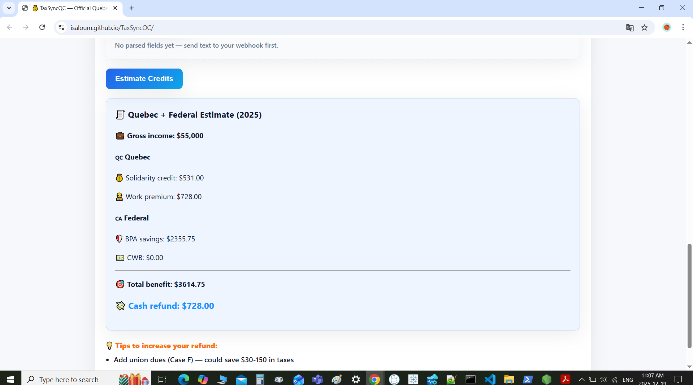
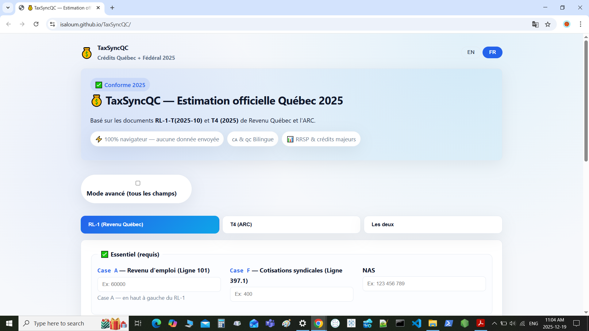
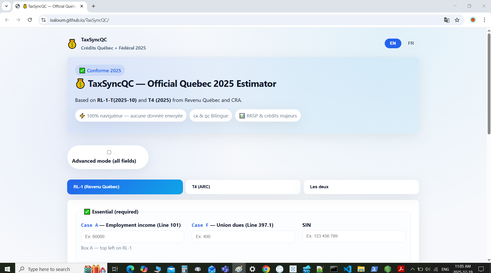

# 💰 TaxFlowAI

**AI-Powered Tax Management for Canada (2025)**

A free, open-source, bilingual (FR/EN) tool with AI-powered features to manage your taxes, estimate credits, and optimize your RRSP impact across Canada. Powered by intelligent document processing and accurate calculations.

🌐 **Live Web App:** [https://Isaloum.github.io/TaxFlowAI](https://Isaloum.github.io/TaxFlowAI)

---

## ✨ Features

### 🤖 **NEW: Document Automation**

**Automatically process tax documents with AI-powered extraction!**

- **Supported Documents:**
  - 📄 T4, RL-1, T4A, RL-2 (tax slips)
  - 🚗 Uber/Lyft summaries, taxi statements
  - ⛽ Gas receipts, maintenance bills
  - 📱 Phone bills, insurance, parking receipts
- **Smart Classification** - Automatically identifies document types
- **Data Extraction** - Extracts income, deductions, expenses
- **Tax Calculations** - Instant tax impact estimates
- **87% Test Coverage** - Comprehensive test suite (157 tests)

📚 **Documentation:**
- **[Email Integration Guide](./EMAIL_INTEGRATION_GUIDE.md)** - Complete setup and usage
- **[AWS SES Setup](./AWS_SES_SETUP.md)** - Email service configuration
- **[Deployment Guide](./DEPLOYMENT.md)** - Production deployment

### 🧮 **Accurate 2025 Calculations**

- **Quebec Credits:**
  - Solidarity Tax Credit (Crédit pour la solidarité) — up to $531
  - Work Premium (Prime au travail) — up to $728 single / $1,456 with dependents
- **Federal Credits:**
  - Basic Personal Amount (BPA) savings — $15,705 × 15%
  - Canada Workers Benefit (CWB / PTE) — up to $1,519
- **RRSP Impact:**
  - Tax savings at your marginal rate (28.85% / 33.25% / 38.85%)
  - Shows how RRSP contributions unlock hidden credits

### 🌍 **Fully Bilingual (FR/EN)**

- French-first design (Quebec default language)
- One-click toggle to English
- All labels, results, and warnings translate dynamically
- Proper Quebec terminology (NAS → SIN, RRQ → QPP, etc.)

---

## 📸 Screenshots

### Calculator Interface (English)


### Bilingual Support (Français)


### Results Display


> **Live Demo:** Try it yourself at [https://isaloum.github.io/TaxFlowAI/](https://isaloum.github.io/TaxFlowAI/)

---


### 🔒 **Privacy-First**

- **100% client-side** — all calculations run in your browser
- **No data sent to servers** — your tax info never leaves your device
- **No tracking, no cookies, no accounts** — completely anonymous
- Open source — audit the code yourself

### 🎯 **User-Friendly**

- **Simple mode:** 3 essential fields (income, union dues, SIN)
- **Advanced mode:** Full RL-1/T4 coverage (deductions, benefits, etc.)
- **Box/line referencing:** See exactly where to find data on your slips
  - RL-1 Box A → TP-1 Line 101
  - T4 Box 14 → T1 Line 10100
- **Structured JSON export:** For automation/integration with tax software

### 🚀 **Dual Interface**

- **Web UI:** Drag-and-drop interface at [isaloum.github.io/TaxFlowAI](https://isaloum.github.io/TaxFlowAI)
- **CLI tool:** \`node cli.js --rl1 "Case A: 60000" --rrsp 5000\`

## 🔗 Connect the web app to n8n (parse email/text)

You can pipe raw payroll emails or copied PDF text through an n8n webhook and let the web app auto-fill the RL-1/T4 fields:

1. **Create an n8n Webhook** node (POST) and grab the URL. Store it in the UI’s “n8n webhook URL” field (it’s saved to `localStorage`).
2. **Parse the incoming text** in your workflow (e.g., OpenAI/Claude node or Regex). Return JSON like:
   ```json
   {
     "rl1": { "A": 60000, "F": 400, "B.A": 3200 },
     "t4": { "14": 60000, "44": 400 },
     "rrsp": 5000
   }
   ```
   Keys map to the on-page field IDs (punctuation is ignored, so `B.A` → `rl1_BA`, `D-1` → `rl1_D1`). Include whichever slip you’re parsing.
3. **Paste any email/text** into the new “Paste email/text to parse” box and click **Send to n8n**. Once the webhook replies, hit **Apply parsed fields** to load the values into the calculator and run your estimate.

Tip: Add validation/guardrails in n8n (e.g., clamp to positive numbers, mark confidence) before returning the JSON to the app.
**Troubleshooting**

- The UI validates the webhook URL (must be http/https) and will flag malformed or empty responses.
- If the webhook returns non-numeric slip values or no RL-1/T4/RRSP fields, the app will show an error and skip applying them.
- Some workflows wrap data in a `data` object; the app automatically unwraps this shape.

---

## 📖 How to Use

### **Web App (Recommended)**

1. Visit **[https://Isaloum.github.io/TaxFlowAI](https://Isaloum.github.io/TaxFlowAI)**
2. Choose your slip type: **RL-1** (Quebec) or **T4** (Federal)
3. Enter your income (Box A / Box 14)
4. Optionally: Add union dues, adjust RRSP contribution slider
5. Click **"Estimer les crédits"** / **"Estimate Credits"**
6. See your instant results:
   - Total tax benefit
   - Cash refund breakdown
   - RRSP tax savings

**Toggle to Advanced Mode** to enter deductions (QPP, QPIP, RPP, charitable donations, etc.)

---

## 🔧 Technical Details

### **Tech Stack**

- **Frontend:** Vanilla JavaScript (ES6+ modules)
- **No dependencies** — pure HTML/CSS/JS
- **No build step** — works directly in any modern browser
- **Hosting:** GitHub Pages (static site)

### **Calculation Accuracy**

- ✅ Solidarity Credit: $531 base, phased out $57,965–$64,125
- ✅ Work Premium: 26% rate on income above $7,200, capped at $728
- ✅ Federal CWB: 27% build-up, 15% reduction after $25,539
- ✅ RRSP marginal rates: Combined QC+Fed rates (28.85% / 33.25% / 38.85%)

---

## 🛣️ Roadmap

### **Phase 1: MVP** ✅ _DONE_

- [x] Basic RL-1/T4 parsing
- [x] Quebec + Federal credit calculations
- [x] RRSP impact estimator
- [x] Bilingual web UI
- [x] CLI tool
- [x] GitHub Pages deployment

### **Phase 2: Enhanced UX** (Next 2 weeks)

- [ ] **PDF auto-extraction** — drag & drop your RL-1/T4 PDF → auto-fill boxes
- [ ] **RRSP optimizer chart** — visualize tax savings vs contribution
- [ ] **Multi-year comparison** — save & compare 2024 vs 2025

### **Phase 3: Pro Features** (Next month)

- [ ] **CRA/RQ XML export** — generate files for UFile/TurboTax
- [ ] **More credits:** Childcare, Medical, CCB
- [ ] **Multi-province support** — Ontario, BC, Alberta

---

## 📜 License

**MIT License** — free to use, modify, and distribute.

---

## 🙏 Credits

**Created by:** [Ihab Saloum](https://github.com/Isaloum)

**Built with AI assistance** — Demonstrating how electrical engineers can ship real software using Claude as a force multiplier.

---

## 💡 Why I Built This

As an electrical engineer in Quebec, I was frustrated with expensive tax software charging $20-50/year for basic estimates with no transparency and no RRSP optimizer.

So I built TaxFlowAI in **72 hours** using AI (Claude Sonnet 4.5) to give Canadians a **free, transparent** tax estimator with AI-powered document processing.

If this saves you money, consider ⭐ starring the repo or sharing with friends!

---

## ⚖️ Disclaimer

This tool provides **estimates only** and is **not a substitute for professional tax advice**. Always consult a qualified accountant for your final tax return.

**Use at your own risk.**

---

**🇨🇦 Made in Canada, for Canada. Fait au Canada, pour le Canada. 🇨🇦**
